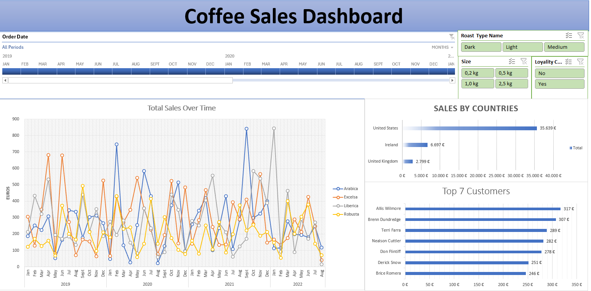

# ☕ Coffee Sales Dashboard (Excel Project)

## 📌 Overview

Welcome to the **Coffee Sales Dashboard**, an Excel-based interactive project designed to provide clear and dynamic insights into coffee sales performance across various dimensions. This project brings data to life with compelling visuals and practical analysis tools.

## ✨ What’s Inside?

- 📈 **Top 5 Customers** – Quick view of your highest value customers.
- 🌍 **Sales by Country** – Compare international performance at a glance.
- 📅 **Sales Over Time** – Spot trends and seasonality using time series visuals.
- 💶 **Total Sales Overview** – Get a full picture of your revenue.
- 📦 **Sales by Product Size** – Understand which product sizes drive volume.
- 🧾 **Loyalty Card Impact** – See how loyalty programs influence sales.

## 🧰 Excel Tools & Techniques

- **Pivot Tables & Charts** – For dynamic summarization  
- **Slicers** – For intuitive filtering  
- **Conditional Formatting** – For enhanced readability  
- **XLOOKUP** – For accurate, real-time data referencing

## 🖼️ Dashboard Preview

## 📁 File

- `coffeeOrdersData.xlsx`

---

This project is a great example of how Excel can be used not just for spreadsheets, but for **visually engaging and strategic business intelligence**. Ideal for presentations, reporting, or internal business reviews.
